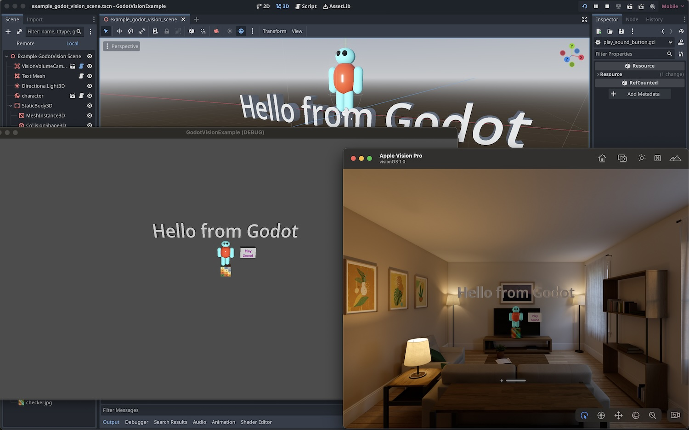

# GodotVisionExample

### Questions? Join the [GodotVision Discord](https://discord.gg/XvB4dwGUtF)

An example Xcode project which has [GodotVision](https://github.com/kevinw/GodotVision) as a package dependency, and an example Godot project in `Godot_Project`. 

## To Run

- Get the newest Xcode (15.2).
- Install the visionOS SDK when it asks you which platforms you'd like to deploy to.
- Clone this repository.
- **❗❗ VERY IMPORTANT ❗❗** Open `Godot_Project/project.godot` in Godot. (This is so that Godot's asset importers run.)
- Back in Xcode, set the target next to the play button to be Apple Vision Pro simulator.
- Hit play. You'll get an error that you need to "Trust and Enable" the macros in [SwiftGodot](https://github.com/migueldeicaza/SwiftGodot) and [SwiftGodotKit](https://github.com/migueldeicaza/SwiftGodotKit). You may need to click the build error in the issues tab to enable them.
- Hit play again. The first build will be slow, since we need to compile SwiftGodot, which includes Swift bindings for all of Godot's gdextension API. Subsequent builds will be faster!

## To Hack on GodotVision

GodotVision is referenced as a Package Dependency in this example repo. If you want to modify GodotVision:

* Clone the [GodotVision](https://github.com/kevinw/GodotVision) repository next to your project.
* Drag the GodotVision folder onto your Xcode project's navigator/file tree on the left. This establishes a local package dependency and changes to GodotVision you make will have immediate effect in your project.
